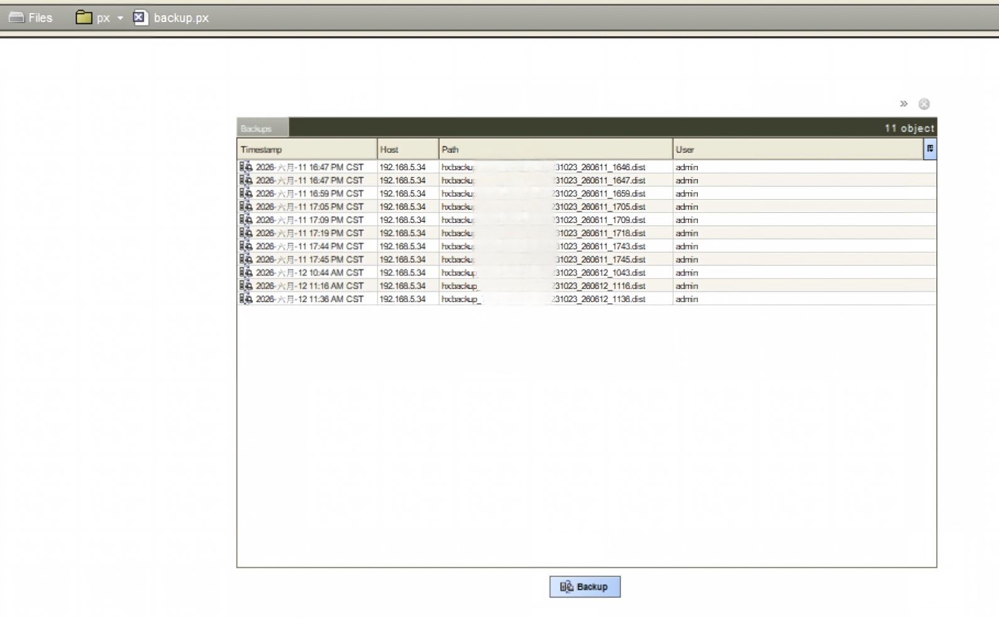

# 🏗️ Niagara Station Automatic Backup and Email

> Free Niagara Station backup automation — SCRAM-SHA-256 auth → download `.dist` → NAS archive → email delivery

This tool is **completely free** for any Niagara system. It works by accessing the built-in `backup.px` page via the web interface, which uses the **default BackupService** that comes with every Niagara station — no paid licenses, no additional modules required. The script simply automates the manual process of logging in, clicking the backup button, and saving the resulting `.dist` file.

Supports Niagara 4.10+ (including JACE-8000 and Niagarax).

---

## How It Works

```
Manual Setup                     Auto Backup Script
┌─────────────────────┐      ┌──────────────────────────┐
│                     │      │                          │
│  Station Files/     │      │  1. SCRAM login to station│
│  └── px/            │      │  2. Request backup.px    │
│      └── backup.px  │ ────→│  3. Extract CSRF token   │
│          ↑ create me│      │  4. Click Backup Button   │
│                     │      │  5. Download .dist file  │
│  backup.px setup:   │      │  6. Save: Local + NAS    │
│  Drag BackupService │      │  7. Git push to GitHub   │
│  select "backup"    │      │  8. Optional email send  │
│  view, save file    │      └──────────────────────────┘
└─────────────────────┘
```

### ⚠️ Key Prerequisite: Create backup.px Manually

This script works by simulating a user visiting the station's backup page in a browser. By default, Niagarax does **not** include a `backup.px` file. You must create one manually in Workbench or the Niagarax web interface.

**Steps:**
1. Log into Niagara Workbench (or Niagarax web backend)
2. Navigate to `Files → px/`
3. Create a new PX file named **`backup.px`**
4. From the Palette, drag the **`BackupService`** component onto the page
5. In the dialog, select the **`backup`** view (or `BackupManager`)
6. Save the file

> After setup, visiting `http://YOUR_STATION_IP/px/backup.px` should show a backup management page with a **Start Backup** button.


*Example: backup.px page in the web interface, showing the backup button the script will click.*

---

## Features

- ✅ SCRAM-SHA-256 3-step AJAX authentication (N4.10 / N4.14 / Niagarax)
- ✅ Access backup.px → extract CSRF token → trigger backup download
- ✅ Download `.dist` backup files
- ✅ Local + NAS dual storage
- ✅ Git push to GitHub (triple redundancy)
- ✅ Email delivery with attachment (SMTP)
- ✅ Single-file script, zero external deps (Node.js built-ins + nodemailer)

---

## Quick Start

### 1. Clone / Download

```bash
git clone <your-repo-url>
cd niagara-station-backup
```

### 2. Install dependencies

```bash
npm install nodemailer
```

### 3. Configure environment

```bash
cp .env.example .env
```

Edit `.env` with your station and email credentials (see `.env.example` for all options):

```ini
# Replace with your Niagara Station details
STATION_HOST=192.168.x.x
STATION_PORT=80
STATION_SSL=false
STATION_USER=admin
STATION_PASS=your_password
STATION_NAME=Your_Station_Name

# SMTP settings (example: Tencent Exmail, change to your provider)
EMAIL_USER=your@email.com
EMAIL_PASS=your_smtp_password
EMAIL_HOST=smtp.example.com
EMAIL_PORT=465
EMAIL_TO=your@email.com

# NAS backup path (optional)
NAS_PATH=\\\\your-nas-server\\share\\backup

# Local save directory (default ./backups)
SAVE_DIR=./backups
```

### 4. Run backup

```bash
# Full flow: backup + NAS + email
node niagara-backup.js

# Backup only, no email
node niagara-backup.js --no-email

# Custom save directory
node niagara-backup.js --dir /path/to/save
```

---

## Commands

| Command | Description |
|---------|-------------|
| `node niagara-backup.js` | Full backup with email |
| `--no-email` | Skip email sending |
| `--dir /path` | Custom save directory |
| `--dry-run` | Test authentication only |
| `--verbose` | Detailed logging |

---

## Automated Full Flow

```bash
cd <project-directory>

# Backup station
node niagara-backup.js --no-email

# Auto-commit backup file to GitHub
git add -A
git commit -m "Backup $(date +%%Y-%%m-%%d_%%H:%%M)"
git push
```

### Backup Storage Locations

| Layer | Path |
|-------|------|
| 💻 Local | `backups/` (same dir as script) |
| 🗄️ NAS | `\\your-nas-server\share\niagara-backups\` |
| ☁️ GitHub | `https://github.com/your-username/niagara-station-backup` |

---

## Multi-Station Setup

Create separate `.env` files for each station, then copy before running:

```
.env.station1   → Station 1 credentials
.env.station2   → Station 2 credentials
...
```

Usage:
```bash
copy .env.station1 .env
node niagara-backup.js --no-email
```

---

## Scheduling

### Windows Task Scheduler

```
Trigger: Daily at 00:00, 12:00
Action:  node D:\scripts\niagara-backup.js
```

### Linux / macOS crontab

```cron
0 */12 * * * cd /home/user/niagara-station-backup && /usr/bin/node niagara-backup.js >> backup.log 2>&1
```

---

## Project Structure

```
niagara-station-backup/
├── niagara-backup.js     ← Main script (backup engine)
├── .env.example          ← Config template (no secrets)
├── .env                  ← Your actual config (in .gitignore)
├── .env.station1         ← Multi-station: station 1 config
├── .env.station2         ← Multi-station: station 2 config
├── README.md             ← This file
├── backups/              ← Backup output dir (auto-created)
├── SKILL.md              ← OpenClaw AI skill definition
└── .gitignore
```

---

## Tech Details

### Authentication Flow

```
POST /prelogin (username)
  → SCRAM step 1 AJAX (client-first-message)
  → SCRAM step 2 AJAX (client-final-message + proof)
  → Session cookie
  → GET /px/backup.px
  → Extract CSRF token
  → Trigger backup download (startBackup=true)
```

### SCRAM-SHA-256 Auth

Niagara N4.10+ / Niagarax uses a **3-step XHR-based SCRAM**:
1. `action=sendClientFirstMessage` — send client nonce
2. Server responds with salt + iterations + server nonce
3. `action=sendClientFinalMessage` — send computed SCRAM proof
4. Server validates and redirects to set session cookie

### Backup File

`.dist` files are ZIP archives (PK header) containing:
- `niagara_home/` — platform files
- `niagara_user_home/stations/<Name>/shared/` — station shared data

> **Note:** `.dist` is a distribution backup. It does NOT include PX files created dynamically via StringToFile or Workbench.

---

## FAQ

**Q: backup.px returns 404?**
A: Check that the file exists at `Files/px/backup.px`. This file must be created manually in Workbench — it is not included by default in Niagarax installations.

> 💡 See the screenshot above for what a correctly configured backup.px looks like in the browser.

**Q: Backup file too large for email?**
A: Use `--no-email` flag. Large files are automatically saved locally + NAS + GitHub. No email needed.

**Q: NAS connection fails?**
A: Ensure the NAS is powered on and network is reachable. The script will skip NAS on failure without interrupting the backup.

**Q: How to verify the script can log in?**
A: Run with `--dry-run` first:
```bash
node niagara-backup.js --dry-run
```

---

## Contact

Questions or suggestions? Email me at: **jason.zhang@gline-net.com**

---

## License

MIT
